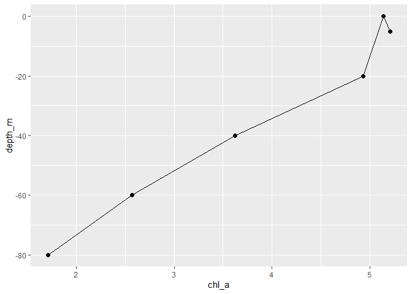
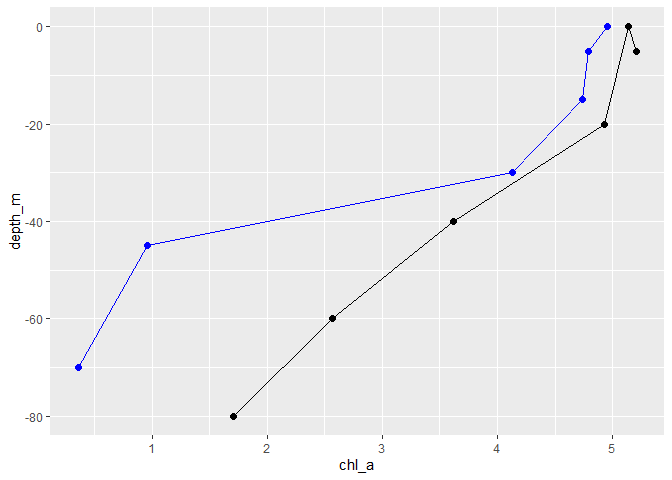
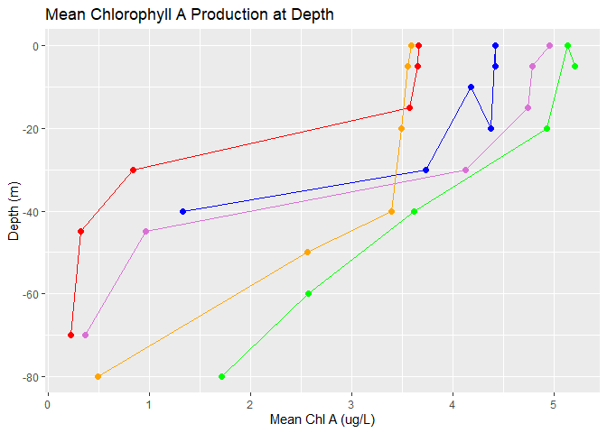
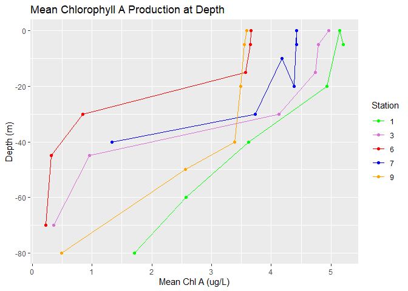
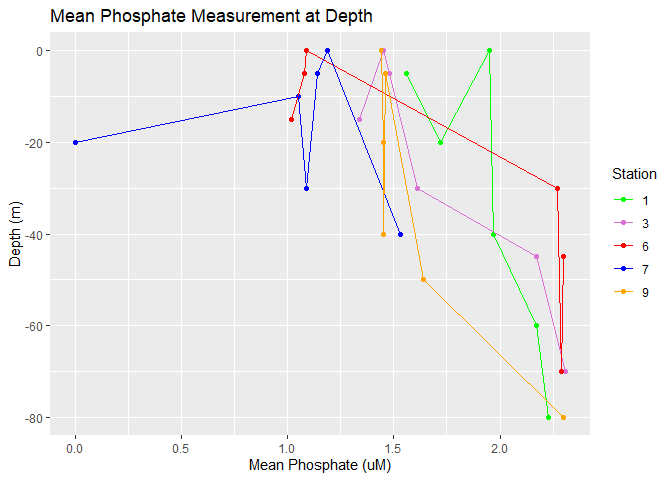
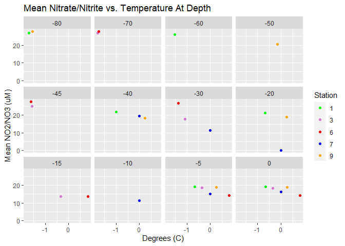
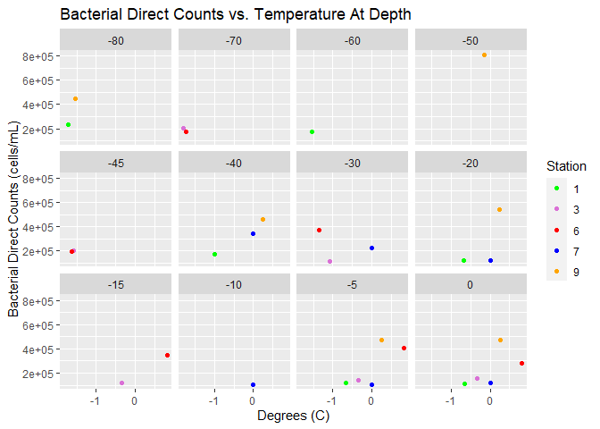

Final Project
================
Barbara Klein and Lovell Smith
12/6/2020

### The intended rationale for this project (submitted during hw9) ended up being a little more than Lovell and I could handle. Upon direction from the course instructor, we pre-processed the data file ‘grinches.csv’, to make a series of scatter plots regarding the data collected at each depth from a 2004 research cruise in the Ross Sea. Kriging was our original plan, but we didn’t have enough data (or the right data) to carry out such an analysis. The following markdown file will show various ways to pre-process the mapping file, as well as different avenues on creating plots to visualize the data.

  - The .csv file can be found in the ‘data’ folder.
  - The ‘Rproj’ was reassigned from “NONE” to a new Rproj. within the
    ‘micro\_490’ folder. This made accessing the .csv file much easier
    for R to find and retrieve.
  - Some pre-processing may look different than previously submitted due
    to the project itself being changed.

#### We will begin pre-processing to create a tidyformat data frame.

  - Make sure you have tidyverse to access both dplyr and ggplot2.

<!-- end list -->

``` r
library(tidyverse)
```

    ## -- Attaching packages ------------------------------------------------------------------- tidyverse 1.3.0 --

    ## v ggplot2 3.3.2     v purrr   0.3.4
    ## v tibble  3.0.3     v dplyr   1.0.2
    ## v tidyr   1.1.2     v stringr 1.4.0
    ## v readr   1.3.1     v forcats 0.5.0

    ## -- Conflicts ---------------------------------------------------------------------- tidyverse_conflicts() --
    ## x dplyr::filter() masks stats::filter()
    ## x dplyr::lag()    masks stats::lag()

``` r
grinches_full <- read.csv(file = "C:/Users/User/Documents/micro_490/reproducible_data_analysis/data/grinches/grinches.csv", 
                          header = TRUE, 
                          na.strings = c(""," ", "ND", "NA")
                          ) 
```

  - We will rename in R as ‘grinches\_full’ alluding to the fully
    unaltered file. Here we say header = TRUE where the first row are
    names of the proceeding columns.
  - ‘na.strings’ allows us to go through the .csv file and remove any
    empty cells - ("“), cells with one space in them - (” “), or cells
    with”ND" (for NO DATA").

<!-- end list -->

``` r
grinches_tibble <- as_tibble(grinches_full) #make grinches_full data set as a tibble
grinches_tibble 
```

    ## # A tibble: 41 x 29
    ##    ï...SampleID BarcodeSequence LinkerPrimer Sample.Name. Station Tube.number
    ##    <chr>        <lgl>           <lgl>        <chr>        <chr>   <chr>      
    ##  1 Lisa201-B1   NA              NA           G48          G9A     48         
    ##  2 Lisa202-B2   NA              NA           G50          G9A     50         
    ##  3 Lisa203-B3   NA              NA           G52          G9A     52         
    ##  4 Lisa204-B4   NA              NA           G54          G9A     54         
    ##  5 Lisa205-B5   NA              NA           G56          G9A     56         
    ##  6 Lisa206-B6   NA              NA           G58          G9A     58         
    ##  7 Lisa207-B7   NA              NA           G60          G9A     60         
    ##  8 Lisa208-B8   NA              NA           G88          G9B     88         
    ##  9 Lisa209-B9   NA              NA           G114         G10A    114        
    ## 10 Lisa210-B10  NA              NA           G116         G10A    116        
    ## # ... with 31 more rows, and 23 more variables: Depth..m. <chr>,
    ## #   Preserved.For <chr>, Julian.Date <chr>, LATITUDE..S. <chr>,
    ## #   LONGITUDE <chr>, DIRECT.COUNTS <chr>, Chl.a <chr>, DPM..leucine. <chr>,
    ## #   Bacterial.Prod. <chr>, Description <chr>, Depth <chr>,
    ## #   Mean..NO3.NO2. <chr>, Mean..NO2. <chr>, Mean..NO3. <chr>, Mean..DSI. <chr>,
    ## #   Mean..PO4.µM. <chr>, Mean..NH4.µM. <chr>, CTD.DEPTH <chr>, sigma.t <chr>,
    ## #   Salinity.psu <chr>, TÂ.C <chr>, X <lgl>, X.1 <chr>

  - As we’re looking at the tibble, there are undesirable names, so we
    will rename them with the dplyr::rename() function which comes with
    tidyverse. We also don’t need columns “SampleID”, “BarcodeSequence”,
    “Depth”, “Sample.Name.”, “LinkerPrimer”, “Description”,
    “Tube.number”, “Preserved.For”, “X”, or “X.1” since we don’t
    need repeat data, or data pertaining to DNA extractions. These will
    be ‘dropped’ with the dplyr::select(-c()) function.

<!-- end list -->

``` r
colnames(grinches_tibble) #shows original column names
```

    ##  [1] "ï...SampleID"    "BarcodeSequence" "LinkerPrimer"    "Sample.Name."   
    ##  [5] "Station"         "Tube.number"     "Depth..m."       "Preserved.For"  
    ##  [9] "Julian.Date"     "LATITUDE..S."    "LONGITUDE"       "DIRECT.COUNTS"  
    ## [13] "Chl.a"           "DPM..leucine."   "Bacterial.Prod." "Description"    
    ## [17] "Depth"           "Mean..NO3.NO2."  "Mean..NO2."      "Mean..NO3."     
    ## [21] "Mean..DSI."      "Mean..PO4.µM."  "Mean..NH4.µM."  "CTD.DEPTH"      
    ## [25] "sigma.t"         "Salinity.psu"    "TÂ.C"            "X"              
    ## [29] "X.1"

``` r
grinches_tibble2 <- grinches_tibble %>%
  dplyr::select(-c(
      "ï...SampleID",
      "Julian.Date",
      "BarcodeSequence", 
      "Depth", 
      "Sample.Name.",
      "LinkerPrimer", 
      "Description", 
      "Tube.number",
      "Preserved.For", 
      "X", 
      "X.1", 
   )) %>%  
dplyr::rename(c(
    x = LATITUDE..S., 
    y = LONGITUDE, 
    station = Station,
    dir_cts = DIRECT.COUNTS,
    chl_a = Chl.a,
    leucine = DPM..leucine.,
    bac_prod = Bacterial.Prod.,
    depth_m = Depth..m., 
    mean_no3_no2 = Mean..NO3.NO2.,
    mean_no2 = Mean..NO2.,
    mean_no3 = Mean..NO3.,
    mean_dsi = Mean..DSI.,
    mean_po4 = Mean..PO4.µM.,
    ctd_depth = CTD.DEPTH, 
    sig_t = sigma.t, 
    mean_nh4 = Mean..NH4.µM.,
    sal_psu = Salinity.psu,
    degrees_c = TÂ.C,
  )) 
```

  - We have a desired tibble with removed columns we don’t need, as well
    as correctly named columns for a data frame.

<!-- end list -->

``` r
grinches_tibble2 #We see the grinches_tibble_2 outcome, but row 41 has no useful information other than "control" for every column. So we will get rid of row 41.
```

    ## # A tibble: 41 x 18
    ##    station depth_m x     y     dir_cts chl_a leucine bac_prod mean_no3_no2
    ##    <chr>   <chr>   <chr> <chr> <chr>   <chr> <chr>   <chr>    <chr>       
    ##  1 G9A     5       7630~ 1790~ 1.16E+~ 5.21  4031    0.283    19.24       
    ##  2 G9A     20      7630~ 1790~ 1.20E+~ 4.93  4356    0.257    21.22       
    ##  3 G9A     40      7630~ 1790~ 1.69E+~ 3.62  4332    0.183    21.75       
    ##  4 G9A     60      7630~ 1790~ 1.73E+~ 2.57  3318    0.227    26          
    ##  5 G9A     80      7630~ 1790~ 2.32E+~ 1.71  2025    0.205    26.86       
    ##  6 G9A     250     7630~ 1790~ 1.87E+~ <NA>  <NA>    <NA>     <NA>        
    ##  7 G9A     0       7630~ 1790~ 1.13E+~ 5.14  3313    0.285    19.02       
    ##  8 G9B     5       7630~ 1790~ 1.15E+~ 4.51  <NA>    <NA>     <NA>        
    ##  9 G10A    0       7659~ 1795~ 1.56E+~ 4.96  538     0.506    18.42       
    ## 10 G10A    5       7659~ 1795~ 1.41E+~ 4.79  491     0.5      18.44       
    ## # ... with 31 more rows, and 9 more variables: mean_no2 <chr>, mean_no3 <chr>,
    ## #   mean_dsi <chr>, mean_po4 <chr>, mean_nh4 <chr>, ctd_depth <chr>,
    ## #   sig_t <chr>, sal_psu <chr>, degrees_c <chr>

``` r
grinches_tibble2 <- grinches_tibble2[-c(41),]
grinches_tibble2 #here it prints 40 rows instead of 41
```

    ## # A tibble: 40 x 18
    ##    station depth_m x     y     dir_cts chl_a leucine bac_prod mean_no3_no2
    ##    <chr>   <chr>   <chr> <chr> <chr>   <chr> <chr>   <chr>    <chr>       
    ##  1 G9A     5       7630~ 1790~ 1.16E+~ 5.21  4031    0.283    19.24       
    ##  2 G9A     20      7630~ 1790~ 1.20E+~ 4.93  4356    0.257    21.22       
    ##  3 G9A     40      7630~ 1790~ 1.69E+~ 3.62  4332    0.183    21.75       
    ##  4 G9A     60      7630~ 1790~ 1.73E+~ 2.57  3318    0.227    26          
    ##  5 G9A     80      7630~ 1790~ 2.32E+~ 1.71  2025    0.205    26.86       
    ##  6 G9A     250     7630~ 1790~ 1.87E+~ <NA>  <NA>    <NA>     <NA>        
    ##  7 G9A     0       7630~ 1790~ 1.13E+~ 5.14  3313    0.285    19.02       
    ##  8 G9B     5       7630~ 1790~ 1.15E+~ 4.51  <NA>    <NA>     <NA>        
    ##  9 G10A    0       7659~ 1795~ 1.56E+~ 4.96  538     0.506    18.42       
    ## 10 G10A    5       7659~ 1795~ 1.41E+~ 4.79  491     0.5      18.44       
    ## # ... with 30 more rows, and 9 more variables: mean_no2 <chr>, mean_no3 <chr>,
    ## #   mean_dsi <chr>, mean_po4 <chr>, mean_nh4 <chr>, ctd_depth <chr>,
    ## #   sig_t <chr>, sal_psu <chr>, degrees_c <chr>

``` r
sapply(grinches_tibble2, class) #shows all variables return as characters; We need them to be numerics. 
```

    ##      station      depth_m            x            y      dir_cts        chl_a 
    ##  "character"  "character"  "character"  "character"  "character"  "character" 
    ##      leucine     bac_prod mean_no3_no2     mean_no2     mean_no3     mean_dsi 
    ##  "character"  "character"  "character"  "character"  "character"  "character" 
    ##     mean_po4     mean_nh4    ctd_depth        sig_t      sal_psu    degrees_c 
    ##  "character"  "character"  "character"  "character"  "character"  "character"

``` r
grinches_tibble2$depth_m <- as.numeric(as.character(grinches_tibble2$depth_m))
str(grinches_tibble2) #now it shows depth_m as a numeric instead of a character. So we'll go ahead and use this command for our desired columns to be used in the final data frame. 
```

    ## tibble [40 x 18] (S3: tbl_df/tbl/data.frame)
    ##  $ station     : chr [1:40] "G9A" "G9A" "G9A" "G9A" ...
    ##  $ depth_m     : num [1:40] 5 20 40 60 80 250 0 5 0 5 ...
    ##  $ x           : chr [1:40] "7630.005" "7630.005" "7630.005" "7630.005" ...
    ##  $ y           : chr [1:40] "17900.031" "17900.031" "17900.031" "17900.031" ...
    ##  $ dir_cts     : chr [1:40] "1.16E+05" "1.20E+05" "1.69E+05" "1.73E+05" ...
    ##  $ chl_a       : chr [1:40] "5.21" "4.93" "3.62" "2.57" ...
    ##  $ leucine     : chr [1:40] "4031" "4356" "4332" "3318" ...
    ##  $ bac_prod    : chr [1:40] "0.283" "0.257" "0.183" "0.227" ...
    ##  $ mean_no3_no2: chr [1:40] "19.24" "21.22" "21.75" "26" ...
    ##  $ mean_no2    : chr [1:40] "0.09" "0.1" "0.11" "0.08" ...
    ##  $ mean_no3    : chr [1:40] "19.15" "21.12" "21.65" "25.92" ...
    ##  $ mean_dsi    : chr [1:40] "60.28" "62.79" "53.84" "65.21" ...
    ##  $ mean_po4    : chr [1:40] "1.56" "1.72" "1.97" "2.17" ...
    ##  $ mean_nh4    : chr [1:40] "0.02" "0.26" "0.41" "0.84" ...
    ##  $ ctd_depth   : chr [1:40] "5.042681818" "20.04637879" "41.01343662" "59.9687069" ...
    ##  $ sig_t       : chr [1:40] "27.70867273" "27.71133333" "27.73001268" "27.74940517" ...
    ##  $ sal_psu     : chr [1:40] "34.46820455" "34.47104697" "34.47785775" "34.47871552" ...
    ##  $ degrees_c   : chr [1:40] "-0.664125" "-0.672363636" "-0.994483099" "-1.530246552" ...

``` r
# Since we need numeric vectors instead of character vectors, we'll change the station name to a corresponding number, Station G9A will be station 1, Station G9B will be 2, and so on. 
grinches_tibble2$station[grinches_tibble2$station == "G9A"] <- 1
grinches_tibble2$station[grinches_tibble2$station == "G9B"] <- 2
grinches_tibble2$station[grinches_tibble2$station == "G10A"] <- 3
grinches_tibble2$station[grinches_tibble2$station == "G11D"] <- 4
grinches_tibble2$station[grinches_tibble2$station == "G11E"] <- 5
grinches_tibble2$station[grinches_tibble2$station == "G12A"] <- 6
grinches_tibble2$station[grinches_tibble2$station == "G11A"] <- 7
grinches_tibble2$station[grinches_tibble2$station == "G12D"] <- 8
grinches_tibble2$station[grinches_tibble2$station == "G13A"] <- 9
grinches_tibble2$station[grinches_tibble2$station == "G13B"] <- 10
grinches_tibble2
```

    ## # A tibble: 40 x 18
    ##    station depth_m x     y     dir_cts chl_a leucine bac_prod mean_no3_no2
    ##    <chr>     <dbl> <chr> <chr> <chr>   <chr> <chr>   <chr>    <chr>       
    ##  1 1             5 7630~ 1790~ 1.16E+~ 5.21  4031    0.283    19.24       
    ##  2 1            20 7630~ 1790~ 1.20E+~ 4.93  4356    0.257    21.22       
    ##  3 1            40 7630~ 1790~ 1.69E+~ 3.62  4332    0.183    21.75       
    ##  4 1            60 7630~ 1790~ 1.73E+~ 2.57  3318    0.227    26          
    ##  5 1            80 7630~ 1790~ 2.32E+~ 1.71  2025    0.205    26.86       
    ##  6 1           250 7630~ 1790~ 1.87E+~ <NA>  <NA>    <NA>     <NA>        
    ##  7 1             0 7630~ 1790~ 1.13E+~ 5.14  3313    0.285    19.02       
    ##  8 2             5 7630~ 1790~ 1.15E+~ 4.51  <NA>    <NA>     <NA>        
    ##  9 3             0 7659~ 1795~ 1.56E+~ 4.96  538     0.506    18.42       
    ## 10 3             5 7659~ 1795~ 1.41E+~ 4.79  491     0.5      18.44       
    ## # ... with 30 more rows, and 9 more variables: mean_no2 <chr>, mean_no3 <chr>,
    ## #   mean_dsi <chr>, mean_po4 <chr>, mean_nh4 <chr>, ctd_depth <chr>,
    ## #   sig_t <chr>, sal_psu <chr>, degrees_c <chr>

``` r
grinches_tibble2$station <- as.numeric(as.character(grinches_tibble2$station))
grinches_tibble2$x <- as.numeric(as.character(grinches_tibble2$x))
grinches_tibble2$y <- as.numeric(as.character(grinches_tibble2$y))
grinches_tibble2$dir_cts <- as.numeric(as.character(grinches_tibble2$dir_cts))
grinches_tibble2$chl_a <- as.numeric(as.character(grinches_tibble2$chl_a))
grinches_tibble2$leucine <- as.numeric(as.character(grinches_tibble2$leucine))
grinches_tibble2$bac_prod <- as.numeric(as.character(grinches_tibble2$bac_prod))
```

    ## Warning: NAs introduced by coercion

``` r
grinches_tibble2$mean_no3_no2 <- as.numeric(as.character(grinches_tibble2$mean_no3_no2))
grinches_tibble2$mean_no2 <- as.numeric(as.character(grinches_tibble2$mean_no2))
grinches_tibble2$mean_no3 <- as.numeric(as.character(grinches_tibble2$mean_no3))
grinches_tibble2$mean_dsi <- as.numeric(as.character(grinches_tibble2$mean_dsi))
grinches_tibble2$mean_po4 <- as.numeric(as.character(grinches_tibble2$mean_po4))
grinches_tibble2$mean_nh4 <- as.numeric(as.character(grinches_tibble2$mean_nh4))
grinches_tibble2$ctd_depth <- as.numeric(as.character(grinches_tibble2$ctd_depth))
grinches_tibble2$sig_t <- as.numeric(as.character(grinches_tibble2$sig_t))
grinches_tibble2$sal_psu <- as.numeric(as.character(grinches_tibble2$sal_psu))
grinches_tibble2$degrees_c <- as.numeric(as.character(grinches_tibble2$degrees_c))
#all specified columns have now been converted from character vectors to numeric vectors.
```

  - Now we want the depth to read negative for our scatterplots.

<!-- end list -->

``` r
grinches_tibble2$depth_m <- grinches_tibble2$depth_m * -1
grinches_tibble2 #all values now appear to be in the appropriate format.
```

    ## # A tibble: 40 x 18
    ##    station depth_m     x      y dir_cts chl_a leucine bac_prod mean_no3_no2
    ##      <dbl>   <dbl> <dbl>  <dbl>   <dbl> <dbl>   <dbl>    <dbl>        <dbl>
    ##  1       1      -5 7630. 17900.  116000  5.21    4031    0.283         19.2
    ##  2       1     -20 7630. 17900.  120000  4.93    4356    0.257         21.2
    ##  3       1     -40 7630. 17900.  169000  3.62    4332    0.183         21.8
    ##  4       1     -60 7630. 17900.  173000  2.57    3318    0.227         26  
    ##  5       1     -80 7630. 17900.  232000  1.71    2025    0.205         26.9
    ##  6       1    -250 7630. 17900.  187000 NA         NA   NA             NA  
    ##  7       1       0 7630. 17900.  113000  5.14    3313    0.285         19.0
    ##  8       2      -5 7630. 17900.  115000  4.51      NA   NA             NA  
    ##  9       3       0 7660. 17960.  156000  4.96     538    0.506         18.4
    ## 10       3      -5 7660. 17960.  141000  4.79     491    0.5           18.4
    ## # ... with 30 more rows, and 9 more variables: mean_no2 <dbl>, mean_no3 <dbl>,
    ## #   mean_dsi <dbl>, mean_po4 <dbl>, mean_nh4 <dbl>, ctd_depth <dbl>,
    ## #   sig_t <dbl>, sal_psu <dbl>, degrees_c <dbl>

``` r
grinches_df <- as.data.frame(grinches_tibble2)
class(grinches_df) #returns "data.frame" (which is what we want)
```

    ## [1] "data.frame"

``` r
grinches_df[is.na(grinches_df)] <- 0 #this arguments returns the NA's as values of 0 (fine for our data analysis/scatterplots).
grinches_df #we view the data frame where it has turned the NA's to 0. 
```

    ##    station depth_m        x        y dir_cts chl_a leucine  bac_prod
    ## 1        1      -5 7630.005 17900.03  116000  5.21    4031 0.2830000
    ## 2        1     -20 7630.005 17900.03  120000  4.93    4356 0.2570000
    ## 3        1     -40 7630.005 17900.03  169000  3.62    4332 0.1830000
    ## 4        1     -60 7630.005 17900.03  173000  2.57    3318 0.2270000
    ## 5        1     -80 7630.005 17900.03  232000  1.71    2025 0.2050000
    ## 6        1    -250 7630.005 17900.03  187000  0.00       0 0.0000000
    ## 7        1       0 7630.005 17900.03  113000  5.14    3313 0.2850000
    ## 8        2      -5 7630.005 17900.02  115000  4.51       0 0.0000000
    ## 9        3       0 7659.645 17959.74  156000  4.96     538 0.5060000
    ## 10       3      -5 7659.645 17959.74  141000  4.79     491 0.5000000
    ## 11       3     -15 7659.645 17959.74  119000  4.74     729 0.5960000
    ## 12       3     -30 7659.645 17959.74  113000  4.13     830 0.7360000
    ## 13       3     -45 7659.645 17959.74  202000  0.96       0 0.5790000
    ## 14       3     -70 7659.645 17959.74  205000  0.36     944 0.3800000
    ## 15       4      -5 7430.000  1733.00  216000  4.28       0 0.3005709
    ## 16       4     -20 7430.000  1733.00  244000  4.41       0 0.2853377
    ## 17       4     -30 7430.000  1733.00  209000  4.36       0 0.2672203
    ## 18       4     -50 7430.000  1733.00  410000  1.41       0 0.2888092
    ## 19       4     -70 7430.000  1733.00  221000  0.58       0 0.3200559
    ## 20       5      -5 7428.280  1733.00  308000  4.56       0 0.0000000
    ## 21       6       0 7500.256 16700.23  284000  3.66   14738 0.0000000
    ## 22       6      -5 7500.256 16700.23  406000  3.65    1718 0.8710000
    ## 23       6     -15 7500.256 16700.23  349000  3.57    1490 0.6960000
    ## 24       6     -30 7500.256 16700.23  372000  0.84     926 0.2760000
    ## 25       6     -45 7500.256 16700.23  197000  0.32     518 0.1720000
    ## 26       6     -70 7500.256 16700.23  175000  0.22     513 0.1150000
    ## 27       7       0 7430.000 17330.00  117000  4.42    2261 0.7360000
    ## 28       7      -5 7430.000 17330.00  104000  4.42    1595 0.8560000
    ## 29       7     -10 7430.000 17330.00  103000  4.18    1769 0.7510000
    ## 30       7     -20 7430.000 17330.00  121000  4.38    3068 0.7550000
    ## 31       7     -30 7430.000 17330.00  225000  3.73    5432 0.8710000
    ## 32       7     -40 7430.000 17330.00  342000  1.33    4348 0.5650000
    ## 33       8      -5 7456.500 16702.20  461000  2.50       0 0.0000000
    ## 34       9       0 7430.000 17330.00  470000  3.59    1225 0.1120000
    ## 35       9      -5 7430.000 17330.00  470000  3.55     886 0.0808000
    ## 36       9     -20 7430.000 17330.00  540000  3.49       0 0.0000000
    ## 37       9     -40 7430.000 17330.00  459000  3.39     526 0.0500000
    ## 38       9     -50 7430.000 17330.00  812000  2.56       0 0.0000000
    ## 39       9     -80 7430.000 17330.00  448000  0.49       0 0.0000000
    ## 40      10      -5 7430.000 17330.00  450000  3.00       0 0.0000000
    ##    mean_no3_no2 mean_no2 mean_no3 mean_dsi mean_po4 mean_nh4 ctd_depth    sig_t
    ## 1         19.24     0.09    19.15    60.28     1.56     0.02  5.042682 27.70867
    ## 2         21.22     0.10    21.12    62.79     1.72     0.26 20.046379 27.71133
    ## 3         21.75     0.11    21.65    53.84     1.97     0.41 41.013437 27.73001
    ## 4         26.00     0.08    25.92    65.21     2.17     0.84 59.968707 27.74941
    ## 5         26.86     0.08    26.78    66.45     2.23     0.79 90.014347 27.77384
    ## 6          0.00     0.00     0.00     0.00     0.00     0.00  0.000000  0.00000
    ## 7         19.02     0.09    18.93    61.25     1.95     0.09  1.960863 27.70888
    ## 8          0.00     0.00     0.00     0.00     0.00     0.00  0.000000  0.00000
    ## 9         18.42     0.12    18.30    54.19     1.45     0.22  1.939458 27.59995
    ## 10        18.44     0.13    18.31    50.28     1.48     0.23  4.999283 27.59991
    ## 11        13.62     0.09    13.52    38.48     1.34     0.41 15.026086 27.60072
    ## 12        17.77     0.10    17.67    49.89     1.61     0.95 29.991753 27.67717
    ## 13        24.97     0.07    24.90    67.01     2.17     1.21 45.008603 27.71813
    ## 14        26.77     0.08    26.70    67.72     2.31     1.21 69.987262 27.74345
    ## 15         0.00     0.00     0.00     0.00     0.00     0.00  0.000000  0.00000
    ## 16         0.00     0.00     0.00     0.00     0.00     0.00  0.000000  0.00000
    ## 17         0.00     0.00     0.00     0.00     0.00     0.00  0.000000  0.00000
    ## 18         0.00     0.00     0.00     0.00     0.00     0.00  0.000000  0.00000
    ## 19         0.00     0.00     0.00     0.00     0.00     0.00  0.000000  0.00000
    ## 20         0.00     0.00     0.00     0.00     0.00     0.00  0.000000  0.00000
    ## 21        14.32     0.14    14.18    42.37     1.09     0.25  1.976875 27.38832
    ## 22        14.26     0.13    14.13    43.23     1.08     0.32  5.102083 27.38902
    ## 23        13.66     0.10    13.56    43.91     1.02     0.26 15.061350 27.38904
    ## 24        26.88     0.12    26.75    65.61     2.27     1.18 29.993412 27.74124
    ## 25        27.78     0.16    27.62    63.42     2.30     0.75 44.986044 27.79834
    ## 26        27.84     0.16    27.68    66.14     2.29     0.53 69.976594 27.83164
    ## 27        16.20     0.08    16.12    39.92     1.19     0.37  0.000000  0.00000
    ## 28        15.02     0.06    14.96    39.85     1.14     0.05  0.000000  0.00000
    ## 29        11.32     0.08    11.24    29.55     1.05     0.77  0.000000  0.00000
    ## 30         0.00     0.00     0.00     0.00     0.00     0.00  0.000000  0.00000
    ## 31        11.42     0.07    11.35    30.55     1.09     0.45  0.000000  0.00000
    ## 32        19.61     0.07    19.54    49.10     1.53     0.44  0.000000  0.00000
    ## 33         0.00     0.00     0.00     0.00     0.00     0.00  0.000000  0.00000
    ## 34        18.83     0.12    18.71    46.88     1.44     0.15  3.108154 27.51294
    ## 35        18.91     0.12    18.79    49.08     1.46     0.19  5.126566 27.51509
    ## 36        18.92     0.11    18.81    46.72     1.45     0.21 20.036423 27.51632
    ## 37        18.41     0.12    18.29    44.76     1.45     0.55 40.006687 27.51749
    ## 38        20.60     0.13    20.48    49.52     1.64     0.87 50.095944 27.58168
    ## 39        27.69     0.10    27.59    65.95     2.30     1.08 80.956809 27.73781
    ## 40         0.00     0.00     0.00     0.00     0.00     0.00  0.000000  0.00000
    ##     sal_psu  degrees_c
    ## 1  34.46820 -0.6641250
    ## 2  34.47105 -0.6723636
    ## 3  34.47786 -0.9944831
    ## 4  34.47872 -1.5302466
    ## 5  34.50216 -1.7108693
    ## 6   0.00000  0.0000000
    ## 7  34.46878 -0.6580621
    ## 8   0.00000  0.0000000
    ## 9  34.35155 -0.3465864
    ## 10 34.35144 -0.3477604
    ## 11 34.35243 -0.3477293
    ## 12 34.40866 -1.0809096
    ## 13 34.43840 -1.5785382
    ## 14 34.46197 -1.7934338
    ## 15  0.00000  0.0000000
    ## 16  0.00000  0.0000000
    ## 17  0.00000  0.0000000
    ## 18  0.00000  0.0000000
    ## 19  0.00000  0.0000000
    ## 20  0.00000  0.0000000
    ## 21 34.16837  0.8176458
    ## 22 34.16904  0.8151792
    ## 23 34.16922  0.8170600
    ## 24 34.47533 -1.3635676
    ## 25 34.53545 -1.6232622
    ## 26 34.57232 -1.7377031
    ## 27  0.00000  0.0000000
    ## 28  0.00000  0.0000000
    ## 29  0.00000  0.0000000
    ## 30  0.00000  0.0000000
    ## 31  0.00000  0.0000000
    ## 32  0.00000  0.0000000
    ## 33  0.00000  0.0000000
    ## 34 34.28290  0.2685654
    ## 35 34.28455  0.2535592
    ## 36 34.28536  0.2432635
    ## 37 34.28625  0.2352875
    ## 38 34.34044 -0.1557870
    ## 39 34.46388 -1.5454882
    ## 40  0.00000  0.0000000

#### Now that we have a much cleaner data set, the next part involves comparing certain values at various depths from the different stations where sampling occurred during the cruise. The goal here is to separate each station and turn it into its own data set. We will then assign each station a color and have it all on the same graph. The first step is creating objects that represent each station:

  - Each station corresponds to repeats of a specific set of coordinates
    in the original excel file. There are 6 stations with more than one
    measurement taken at depth, and 2 stations with only one measurement
    taken at depth, for a total of 8 stations.

  - Here we will exclude all rows not associated with a specific
    coordinate (x and y) and its corresponding depth(s). These new
    stations will not be labeled same as the original grinches\_df due
    to a number of rows having undefined values. So we’ll only select
    rows with defined values in them.

<!-- end list -->

``` r
stn_1 <- grinches_df[-c(6, 8:40), ]
stn_2 <- grinches_df[-c(1:8, 15:40), ]
stn_3 <- grinches_df[-c(1:20, 27:40), ]
stn_4 <- grinches_df[-c(1:26, 33:40), ]
stn_5 <- grinches_df[-c(1:33, 40), ]
```

  - Now that we have our stations created with their respective
    measurements, the next step is to create a scatter plot that
    includes all of our different locations, and some variable we want
    plotted (for example, chl\_a at depth). \*Make sure to have ggplot2
    in your library. Here we will layer the plot starting with station
    1.

<!-- end list -->

``` r
stn_1   #here we see the data and respective measurements for 'station 1'
```

    ##   station depth_m        x        y dir_cts chl_a leucine bac_prod mean_no3_no2
    ## 1       1      -5 7630.005 17900.03  116000  5.21    4031    0.283        19.24
    ## 2       1     -20 7630.005 17900.03  120000  4.93    4356    0.257        21.22
    ## 3       1     -40 7630.005 17900.03  169000  3.62    4332    0.183        21.75
    ## 4       1     -60 7630.005 17900.03  173000  2.57    3318    0.227        26.00
    ## 5       1     -80 7630.005 17900.03  232000  1.71    2025    0.205        26.86
    ## 7       1       0 7630.005 17900.03  113000  5.14    3313    0.285        19.02
    ##   mean_no2 mean_no3 mean_dsi mean_po4 mean_nh4 ctd_depth    sig_t  sal_psu
    ## 1     0.09    19.15    60.28     1.56     0.02  5.042682 27.70867 34.46820
    ## 2     0.10    21.12    62.79     1.72     0.26 20.046379 27.71133 34.47105
    ## 3     0.11    21.65    53.84     1.97     0.41 41.013437 27.73001 34.47786
    ## 4     0.08    25.92    65.21     2.17     0.84 59.968707 27.74941 34.47872
    ## 5     0.08    26.78    66.45     2.23     0.79 90.014347 27.77384 34.50216
    ## 7     0.09    18.93    61.25     1.95     0.09  1.960863 27.70888 34.46878
    ##    degrees_c
    ## 1 -0.6641250
    ## 2 -0.6723636
    ## 3 -0.9944831
    ## 4 -1.5302466
    ## 5 -1.7108693
    ## 7 -0.6580621

``` r
str(stn_1)    #here we see stn_1 is a data frame (needed to layer in ggplot)
```

    ## 'data.frame':    6 obs. of  18 variables:
    ##  $ station     : num  1 1 1 1 1 1
    ##  $ depth_m     : num  -5 -20 -40 -60 -80 0
    ##  $ x           : num  7630 7630 7630 7630 7630 ...
    ##  $ y           : num  17900 17900 17900 17900 17900 ...
    ##  $ dir_cts     : num  116000 120000 169000 173000 232000 113000
    ##  $ chl_a       : num  5.21 4.93 3.62 2.57 1.71 5.14
    ##  $ leucine     : num  4031 4356 4332 3318 2025 ...
    ##  $ bac_prod    : num  0.283 0.257 0.183 0.227 0.205 0.285
    ##  $ mean_no3_no2: num  19.2 21.2 21.8 26 26.9 ...
    ##  $ mean_no2    : num  0.09 0.1 0.11 0.08 0.08 0.09
    ##  $ mean_no3    : num  19.1 21.1 21.6 25.9 26.8 ...
    ##  $ mean_dsi    : num  60.3 62.8 53.8 65.2 66.5 ...
    ##  $ mean_po4    : num  1.56 1.72 1.97 2.17 2.23 1.95
    ##  $ mean_nh4    : num  0.02 0.26 0.41 0.84 0.79 0.09
    ##  $ ctd_depth   : num  5.04 20.05 41.01 59.97 90.01 ...
    ##  $ sig_t       : num  27.7 27.7 27.7 27.7 27.8 ...
    ##  $ sal_psu     : num  34.5 34.5 34.5 34.5 34.5 ...
    ##  $ degrees_c   : num  -0.664 -0.672 -0.994 -1.53 -1.711 ...

``` r
chla_plot <- ggplot(data = stn_1, 
                    aes(x = chl_a, 
                        y = depth_m)) + 
                    geom_point(size = 2) +
                    geom_line()
chla_plot  #the first layer of the plot shows the chl_a measurements at depth for station 1. 
```

<!-- -->

``` r
#An option would be to continue layering the plot with each station and keep making plots for our layers.

chla_1_2 <- chla_plot + geom_line(data = stn_2, 
                      aes(x = chl_a), 
                      color = "blue") + 
            geom_point(data = stn_2, 
                      aes(x = chl_a), 
                      color = "blue",
                      size = 2)
chla_1_2 
```

<!-- -->

``` r
#Here is a way to get view our chl_a data across each station at depth. 
ggplot() +
  geom_point(data = stn_1, aes(x = chl_a, 
                               y = depth_m, 
                               color = 'green'), 
                               color = 'green', 
                               size = 2) +
  geom_line(data = stn_1, aes(x = chl_a, 
                              y = depth_m, 
                              color = 'green'), 
                              color = 'green') +
  geom_point(data = stn_2, aes(x = chl_a, 
                               y = depth_m, 
                               color = 'orchid'), 
                               color = 'orchid', 
                               size = 2) +
  geom_line(data = stn_2, aes(x = chl_a, 
                              y = depth_m, 
                              color = 'orchid'), 
                              color = 'orchid') +
  geom_point(data = stn_3, aes(x = chl_a, 
                               y = depth_m, 
                               color = 'red'), 
                               color = 'red', 
                               size = 2) +
  geom_line(data = stn_3, aes(x = chl_a, 
                              y = depth_m, 
                              color = 'red'), 
                              color = 'red') +
  geom_point(data = stn_4, aes(x = chl_a, 
                               y = depth_m, 
                               color = 'blue'), 
                               color = 'blue', 
                               size = 2) +
  geom_line(data = stn_4, aes(x = chl_a, 
                              y = depth_m, 
                              color = 'blue'), 
                              color = 'blue') +
  geom_point(data = stn_5, aes(x = chl_a, 
                               y = depth_m, 
                               color = 'orange'), 
                               color = 'orange', 
                               size = 2) +
  geom_line(data = stn_5, aes(x = chl_a, 
                              y = depth_m, 
                              color = 'orange'), 
                              color = 'orange') +
  labs(color = "Station") +
  xlab("Mean Chl A (ug/L)") +
  ylab("Depth (m)") +
  ggtitle("Mean Chlorophyll A Production at Depth") 
```

<!-- -->

  - In this scatter plot, each station was assigned a color.
    
      - station 1: green
      - station 2: orchid
      - station 3: red
      - station 4: blue
      - station 5: orange

  - ‘Geom\_point’ was used to plot the measurements and ’geom\_line" was
    also used to connect these points to help visualize the trend of
    each station. The size of each dot was increased as well. From this
    graph, we can see that chlorophyll A seems to be more productive
    towards the surface and decreases with depth.

  - We can use this method as a way to discover trends from other
    variables in the data set as well.

##### Similarly, we can use a new dataframe with all stations, and provide a simple argument to make a scatter plot instead of typing the layers of the plot line by line for each station.

``` r
all_stns <- rbind(stn_1, stn_2, stn_3, stn_4, stn_5)  #this combines all previously made data frames from above.
all_stns #we will keep the original station number in this data frame (same number as grinches_df). 
```

    ##    station depth_m        x        y dir_cts chl_a leucine bac_prod
    ## 1        1      -5 7630.005 17900.03  116000  5.21    4031   0.2830
    ## 2        1     -20 7630.005 17900.03  120000  4.93    4356   0.2570
    ## 3        1     -40 7630.005 17900.03  169000  3.62    4332   0.1830
    ## 4        1     -60 7630.005 17900.03  173000  2.57    3318   0.2270
    ## 5        1     -80 7630.005 17900.03  232000  1.71    2025   0.2050
    ## 7        1       0 7630.005 17900.03  113000  5.14    3313   0.2850
    ## 9        3       0 7659.645 17959.74  156000  4.96     538   0.5060
    ## 10       3      -5 7659.645 17959.74  141000  4.79     491   0.5000
    ## 11       3     -15 7659.645 17959.74  119000  4.74     729   0.5960
    ## 12       3     -30 7659.645 17959.74  113000  4.13     830   0.7360
    ## 13       3     -45 7659.645 17959.74  202000  0.96       0   0.5790
    ## 14       3     -70 7659.645 17959.74  205000  0.36     944   0.3800
    ## 21       6       0 7500.256 16700.23  284000  3.66   14738   0.0000
    ## 22       6      -5 7500.256 16700.23  406000  3.65    1718   0.8710
    ## 23       6     -15 7500.256 16700.23  349000  3.57    1490   0.6960
    ## 24       6     -30 7500.256 16700.23  372000  0.84     926   0.2760
    ## 25       6     -45 7500.256 16700.23  197000  0.32     518   0.1720
    ## 26       6     -70 7500.256 16700.23  175000  0.22     513   0.1150
    ## 27       7       0 7430.000 17330.00  117000  4.42    2261   0.7360
    ## 28       7      -5 7430.000 17330.00  104000  4.42    1595   0.8560
    ## 29       7     -10 7430.000 17330.00  103000  4.18    1769   0.7510
    ## 30       7     -20 7430.000 17330.00  121000  4.38    3068   0.7550
    ## 31       7     -30 7430.000 17330.00  225000  3.73    5432   0.8710
    ## 32       7     -40 7430.000 17330.00  342000  1.33    4348   0.5650
    ## 34       9       0 7430.000 17330.00  470000  3.59    1225   0.1120
    ## 35       9      -5 7430.000 17330.00  470000  3.55     886   0.0808
    ## 36       9     -20 7430.000 17330.00  540000  3.49       0   0.0000
    ## 37       9     -40 7430.000 17330.00  459000  3.39     526   0.0500
    ## 38       9     -50 7430.000 17330.00  812000  2.56       0   0.0000
    ## 39       9     -80 7430.000 17330.00  448000  0.49       0   0.0000
    ##    mean_no3_no2 mean_no2 mean_no3 mean_dsi mean_po4 mean_nh4 ctd_depth    sig_t
    ## 1         19.24     0.09    19.15    60.28     1.56     0.02  5.042682 27.70867
    ## 2         21.22     0.10    21.12    62.79     1.72     0.26 20.046379 27.71133
    ## 3         21.75     0.11    21.65    53.84     1.97     0.41 41.013437 27.73001
    ## 4         26.00     0.08    25.92    65.21     2.17     0.84 59.968707 27.74941
    ## 5         26.86     0.08    26.78    66.45     2.23     0.79 90.014347 27.77384
    ## 7         19.02     0.09    18.93    61.25     1.95     0.09  1.960863 27.70888
    ## 9         18.42     0.12    18.30    54.19     1.45     0.22  1.939458 27.59995
    ## 10        18.44     0.13    18.31    50.28     1.48     0.23  4.999283 27.59991
    ## 11        13.62     0.09    13.52    38.48     1.34     0.41 15.026086 27.60072
    ## 12        17.77     0.10    17.67    49.89     1.61     0.95 29.991753 27.67717
    ## 13        24.97     0.07    24.90    67.01     2.17     1.21 45.008603 27.71813
    ## 14        26.77     0.08    26.70    67.72     2.31     1.21 69.987262 27.74345
    ## 21        14.32     0.14    14.18    42.37     1.09     0.25  1.976875 27.38832
    ## 22        14.26     0.13    14.13    43.23     1.08     0.32  5.102083 27.38902
    ## 23        13.66     0.10    13.56    43.91     1.02     0.26 15.061350 27.38904
    ## 24        26.88     0.12    26.75    65.61     2.27     1.18 29.993412 27.74124
    ## 25        27.78     0.16    27.62    63.42     2.30     0.75 44.986044 27.79834
    ## 26        27.84     0.16    27.68    66.14     2.29     0.53 69.976594 27.83164
    ## 27        16.20     0.08    16.12    39.92     1.19     0.37  0.000000  0.00000
    ## 28        15.02     0.06    14.96    39.85     1.14     0.05  0.000000  0.00000
    ## 29        11.32     0.08    11.24    29.55     1.05     0.77  0.000000  0.00000
    ## 30         0.00     0.00     0.00     0.00     0.00     0.00  0.000000  0.00000
    ## 31        11.42     0.07    11.35    30.55     1.09     0.45  0.000000  0.00000
    ## 32        19.61     0.07    19.54    49.10     1.53     0.44  0.000000  0.00000
    ## 34        18.83     0.12    18.71    46.88     1.44     0.15  3.108154 27.51294
    ## 35        18.91     0.12    18.79    49.08     1.46     0.19  5.126566 27.51509
    ## 36        18.92     0.11    18.81    46.72     1.45     0.21 20.036423 27.51632
    ## 37        18.41     0.12    18.29    44.76     1.45     0.55 40.006687 27.51749
    ## 38        20.60     0.13    20.48    49.52     1.64     0.87 50.095944 27.58168
    ## 39        27.69     0.10    27.59    65.95     2.30     1.08 80.956809 27.73781
    ##     sal_psu  degrees_c
    ## 1  34.46820 -0.6641250
    ## 2  34.47105 -0.6723636
    ## 3  34.47786 -0.9944831
    ## 4  34.47872 -1.5302466
    ## 5  34.50216 -1.7108693
    ## 7  34.46878 -0.6580621
    ## 9  34.35155 -0.3465864
    ## 10 34.35144 -0.3477604
    ## 11 34.35243 -0.3477293
    ## 12 34.40866 -1.0809096
    ## 13 34.43840 -1.5785382
    ## 14 34.46197 -1.7934338
    ## 21 34.16837  0.8176458
    ## 22 34.16904  0.8151792
    ## 23 34.16922  0.8170600
    ## 24 34.47533 -1.3635676
    ## 25 34.53545 -1.6232622
    ## 26 34.57232 -1.7377031
    ## 27  0.00000  0.0000000
    ## 28  0.00000  0.0000000
    ## 29  0.00000  0.0000000
    ## 30  0.00000  0.0000000
    ## 31  0.00000  0.0000000
    ## 32  0.00000  0.0000000
    ## 34 34.28290  0.2685654
    ## 35 34.28455  0.2535592
    ## 36 34.28536  0.2432635
    ## 37 34.28625  0.2352875
    ## 38 34.34044 -0.1557870
    ## 39 34.46388 -1.5454882

``` r
chla_allstns <- ggplot(all_stns, 
                       aes(x = chl_a, 
                           y = depth_m, 
                           color = as.factor(station))) +
  geom_point() +
  geom_line() +
  xlab("Mean Chl A (ug/L)") +
  ylab("Depth (m)") +
  ggtitle("Mean Chlorophyll A Production at Depth") +
  labs(color = "Station") +
  theme(legend.key = element_rect("white"))

chla_allstns + scale_color_manual(breaks = c("1", "3", "6", "7", "9"),
                                  values = c("green", "orchid", "red", "blue", "orange"))
```

<!-- -->

  - Here (scatterplot above) is a much faster and simpler way to utilize
    the data in a straightforward manner to view the chl\_a data.

  - We can create a similar graph for other measurements by adjusting
    the x axis parameter. For example, Mean Phosphate Measurements at
    Depth:

<!-- end list -->

``` r
meanpo4_allstns <- ggplot(all_stns, 
                          aes(x = mean_po4, 
                              y = depth_m, 
                              color = as.factor(station))) +
  geom_point() +
  geom_line() +
  xlab("Mean Phosphate (uM)") +
  ylab("Depth (m)") +
  ggtitle("Mean Phosphate Measurement at Depth") +
  labs(color = "Station") +
  theme(legend.key = element_rect("white"))

meanpo4_allstns + scale_color_manual(breaks = c("1", "3", "6", "7", "9"),
                                     values = c("green", "orchid", "red", "blue", "orange"))
```

<!-- -->

#### Alternatively, if we wanted to view mean\_no2\_no3 (mean nitrate and nitrite) at all stations, we could facet wrap the scatter plot and compare each at depth.

``` r
# To view station mean_no3_no2 vs. temperature at depth:
meanN_plot <- ggplot(data = all_stns, 
                     aes(x = degrees_c, 
                         y = mean_no3_no2, 
                         color = as.factor(station))) +
                     geom_point()

meanN_plot + 
  facet_wrap(~ depth_m) +
  scale_color_manual(breaks = c("1", "3", "6", "7", "9"),
                     values = c("green", "orchid", "red", "blue", "orange")) +
  ggtitle("Mean Nitrate/Nitrite vs. Temperature At Depth") +
  xlab("Degrees (C)") +
  ylab("Mean NO2/NO3 (uM)") +
  labs(color = "Station")
```

<!-- -->

  - Now we’ll view all of the data for mean Bacterial Direct Counts vs
    Temperature in the all\_stns data frame and use the facet wrap
    method to view these data at depth.

<!-- end list -->

``` r
dircts_plot <- ggplot(data = all_stns, 
                      aes(x = degrees_c, 
                          y = dir_cts, 
                          color = as.factor(station))) +
                      geom_point()

dircts_plot + 
  facet_wrap(~ depth_m) +
  scale_color_manual(breaks = c("1", "3", "6", "7", "9"),
                     values = c("green", "orchid", "red", "blue", "orange")) +
  ggtitle("Bacterial Direct Counts vs. Temperature At Depth") +
  xlab("Degrees (C)") +
  ylab("Bacterial Direct Counts (cells/mL)") +
  labs(color = "Station")
```

<!-- -->

#### There are a variety of ways to analyze these data, all of which may be useful for a specified outcome. Here, we set out to show meaningful relationships with more than just two aspects of the data frame grinches\_df. From the production of these plots, patterns regarding both abiotic and biotic measurements are apparent as both temperature and depth begin to decrease.
