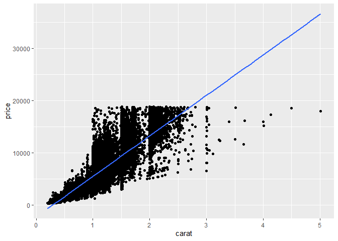

HW10
================
Barbara Klein
11/11/2020

## PART 1 - Linear models:

#### Using the diamonds dataset, create a linear model of price as a function of the weight of the diamond(carat).

``` r
library(tidyverse)
```

    ## -- Attaching packages -------------------------------------------------- tidyverse 1.3.0 --

    ## v ggplot2 3.3.2     v purrr   0.3.4
    ## v tibble  3.0.3     v dplyr   1.0.2
    ## v tidyr   1.1.2     v stringr 1.4.0
    ## v readr   1.3.1     v forcats 0.5.0

    ## -- Conflicts ----------------------------------------------------- tidyverse_conflicts() --
    ## x dplyr::filter() masks stats::filter()
    ## x dplyr::lag()    masks stats::lag()

``` r
diamond_price <- lm (formula = price ~ carat, 
                     data = diamonds)

summary (diamond_price)
```

    ## 
    ## Call:
    ## lm(formula = price ~ carat, data = diamonds)
    ## 
    ## Residuals:
    ##      Min       1Q   Median       3Q      Max 
    ## -18585.3   -804.8    -18.9    537.4  12731.7 
    ## 
    ## Coefficients:
    ##             Estimate Std. Error t value Pr(>|t|)    
    ## (Intercept) -2256.36      13.06  -172.8   <2e-16 ***
    ## carat        7756.43      14.07   551.4   <2e-16 ***
    ## ---
    ## Signif. codes:  0 '***' 0.001 '**' 0.01 '*' 0.05 '.' 0.1 ' ' 1
    ## 
    ## Residual standard error: 1549 on 53938 degrees of freedom
    ## Multiple R-squared:  0.8493, Adjusted R-squared:  0.8493 
    ## F-statistic: 3.041e+05 on 1 and 53938 DF,  p-value: < 2.2e-16

  - According to that model, what price would you expect for a 1 - carat
    diamond?
  - ANS = The price for a 1 carat diamond would be $5,500.07 (7756.43 -
    2256.36 = 5,500.07).

#### Now create a linear model of price as a function of carat and color.

``` r
diamond_color_price <- lm (price ~ carat + color, 
                           data = diamonds)

summary(diamond_color_price)
```

    ## 
    ## Call:
    ## lm(formula = price ~ carat + color, data = diamonds)
    ## 
    ## Residuals:
    ##      Min       1Q   Median       3Q      Max 
    ## -18345.1   -765.8    -72.8    558.5  12288.9 
    ## 
    ## Coefficients:
    ##             Estimate Std. Error  t value Pr(>|t|)    
    ## (Intercept) -2702.23      13.78 -196.054  < 2e-16 ***
    ## carat        8066.62      14.04  574.558  < 2e-16 ***
    ## color.L     -1572.20      22.32  -70.445  < 2e-16 ***
    ## color.Q      -741.14      20.40  -36.333  < 2e-16 ***
    ## color.C      -122.70      19.15   -6.409 1.48e-10 ***
    ## color^4        78.77      17.58    4.480 7.49e-06 ***
    ## color^5      -144.74      16.62   -8.707  < 2e-16 ***
    ## color^6      -180.75      15.08  -11.988  < 2e-16 ***
    ## ---
    ## Signif. codes:  0 '***' 0.001 '**' 0.01 '*' 0.05 '.' 0.1 ' ' 1
    ## 
    ## Residual standard error: 1472 on 53932 degrees of freedom
    ## Multiple R-squared:  0.864,  Adjusted R-squared:  0.8639 
    ## F-statistic: 4.893e+04 on 7 and 53932 DF,  p-value: < 2.2e-16

  - What difference does it make if you convert color to a character
    vector before you make the model? (Note that this is probably what
    you want to do in general, unless you really know what you’re
    doing.) ANS = Color is being represented as a number (originally),
    in R. The diamonds$color summary show color as an ordered factor and
    R has automatically assigned it that way even though I didn’t ask it
    to. So to convert it to a character vector means it isn’t
    automatically ordered by R since we told R it’s a character, it’s
    just assigned a different value for color. So a color value of “E”,
    would correspond to a price value, and so on.

<!-- end list -->

``` r
diamond_color_chr_price <- lm (formula = price ~ carat + as.character(color), 
                               data = diamonds)

summary(diamond_color_chr_price)
```

    ## 
    ## Call:
    ## lm(formula = price ~ carat + as.character(color), data = diamonds)
    ## 
    ## Residuals:
    ##      Min       1Q   Median       3Q      Max 
    ## -18345.1   -765.8    -72.8    558.5  12288.9 
    ## 
    ## Coefficients:
    ##                      Estimate Std. Error  t value Pr(>|t|)    
    ## (Intercept)          -2136.23      20.12 -106.162  < 2e-16 ***
    ## carat                 8066.62      14.04  574.558  < 2e-16 ***
    ## as.character(color)E   -93.78      23.25   -4.033 5.51e-05 ***
    ## as.character(color)F   -80.26      23.40   -3.429 0.000605 ***
    ## as.character(color)G   -85.54      22.67   -3.773 0.000161 ***
    ## as.character(color)H  -732.24      24.35  -30.067  < 2e-16 ***
    ## as.character(color)I -1055.73      27.31  -38.657  < 2e-16 ***
    ## as.character(color)J -1914.47      33.78  -56.679  < 2e-16 ***
    ## ---
    ## Signif. codes:  0 '***' 0.001 '**' 0.01 '*' 0.05 '.' 0.1 ' ' 1
    ## 
    ## Residual standard error: 1472 on 53932 degrees of freedom
    ## Multiple R-squared:  0.864,  Adjusted R-squared:  0.8639 
    ## F-statistic: 4.893e+04 on 7 and 53932 DF,  p-value: < 2.2e-16

  - Make some plots of the raw data, and of the model fits, to make an
    argument as to which model is more useful. (Bonus: Should the data
    have been pre-processed before making these models?)
  - ANS = No I don’t think the data should’ve been pre-processed before
    making the model, because even as I have ggplot taking information
    from my manipulated ‘diamonds’ dataframe(s), the plots all appear
    the same. I’m not sure if this is an error on my part, or if it’s
    just a caviat in R that I’ don’t’m unaware know of.

<!-- end list -->

``` r
ggplot(diamonds, aes(x = carat, y = price)) +
  geom_point() +
  geom_smooth(method = lm)
```

    ## `geom_smooth()` using formula 'y ~ x'

<!-- -->

``` r
ggplot(diamond_color_price, aes(x = carat, y = price)) +
  geom_point() +
  geom_smooth(method = lm)
```

    ## `geom_smooth()` using formula 'y ~ x'

<!-- -->

``` r
ggplot(diamond_color_chr_price, aes(x = carat, y = price)) +
  geom_point () +
  geom_smooth(method = lm)
```

    ## `geom_smooth()` using formula 'y ~ x'

<!-- -->

# PART 2 - Objects and Methods:

#### Write a function that returns some kind of structured result, which you define as a new S3 class. Your class doesn’t need to be anything fancy, but it should be different from existing classes.

``` r
childhood_toys <- function(q, yoyo = "It's the thing on a string") {
  
  # check and make sure the input is a data frame; if not, run stop-message:
  if(!is.data.frame(q)) {
    stop("Initial argument is not a data frame. It needs to be a data frame")
  }
  
  if(!is.character(yoyo)){ 
    stop("yoyo must be a character")
  }
  
  class(q) <- c("funforhours_df", "data.frame")  #I create a class called "funforhours_df"
  attr(q, "yoyo") <- yoyo
  q
}
```

Now I can type the following down in the console:

  - yoyo\_fun \<- childhood\_toys(mtcars)

  - class(yoyo\_fun)

It returns:

  - \[1\] “funforhours\_df” “data.frame”

#### Write, print, and summarise methods for this class. These methods don’t need to be particularly useful, but they should be different from the default methods.

``` r
summary.funforhours_df <- function(q) {
  yoyo <- attr(q, "yoyo")
  print(paste0("yoyo's are fun for many hours - ", yoyo))
  print(summary.data.frame(q))
  summary.data.frame(q)
}
#This function is taking the "yoyo" attribute, and printing 'yoyo's are fun for many hours' and then gives the data frame summary. 
```

Now I can type the following down in the console:

  - “summary(yoyo\_fun)”

And it gives us the summary \[1\] “yoyo’s are fun for many hours - The
thing on a string” along with the mtcars dataframe.

Here I use the sloop package to call the summary to the s3 dispatch
function, on the function called ‘yoyo\_fun’.

  - "sloop::s3\_dispatch(summary(yoyo\_fun))

  - \=\> summary.funforhours\_df

  - \*summary.data.frame

  - \*summary.default"

It successfully found the summary method for ‘yoyo\_fun’

##### It doesn’t say to do this in the HW, but in following along with the video, and I want to validate my class, with a validator function.

``` r
val_funforhours_df <- function(q) {
  if(is.null(attr(q, "yoyo"))) {
    stop("yoyo attribute is not there, or is missing")
  }
  
  # make sure it's a valid data frame. 
  if(!is.data.frame(q, "yoyo")) {
    stop("yoyo needs to be a data frame")
  }
}
```
