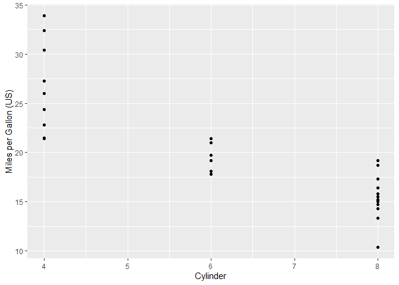

hw\_09\_part2
================
Barbara Klein
11/1/2020

##### 1\. Write a function to calculate variance of a numeric vector.

``` r
#Here I will create my numeric vector: numeric_vec <- as.numeric(c(1, 3, 45, 23, 44, 22, 23, 12, 43, 32, 14))

functionforvariance <-function(numeric_vec) {
  var_vector <- var(numeric_vec)
  var_vector
}

#after the code chunk was run, the 'functions' environment showed up in my global environment, and the variance to my numeric vectors appeared as a result of the function.
```

##### 2\. Write a function (both\_na), in which two vectors of the same length and returns the number of positions that have an NA in both vectors.

``` r
#Here I will create my two vectors of the same length: vec1 <- as.numeric(c(1, 2, NA, 4, 5, 6, NA, NA, 9)) . . .  vec2 <- as.numeric(c(2, 4, NA, 8, 10, 12, NA, 16, 18))

functionforbothNA <- function(vec1, vec2) {
  all_na <- sum(is.na(vec1) & is.na(vec2))
  all_na
}
functionforbothNA(
  c(1, 2, NA, 4, 5, 6, NA, NA, 9),
  c(2, 4, NA, 8, 10, 12, NA, 16, 18)
  )
```

    ## [1] 2

The output R gives, explains that within my numeric vectors of the same
length, two of the positions are the same in that they both have NA
values in the same place.

##### 3\. Write a function to create a specific kind of plot, with useful labels, etc., that can take a data frame as an argument.

``` r
class(mtcars)
```

    ## [1] "data.frame"

``` r
mtcars[c("mpg", "cyl")]
```

    ##                      mpg cyl
    ## Mazda RX4           21.0   6
    ## Mazda RX4 Wag       21.0   6
    ## Datsun 710          22.8   4
    ## Hornet 4 Drive      21.4   6
    ## Hornet Sportabout   18.7   8
    ## Valiant             18.1   6
    ## Duster 360          14.3   8
    ## Merc 240D           24.4   4
    ## Merc 230            22.8   4
    ## Merc 280            19.2   6
    ## Merc 280C           17.8   6
    ## Merc 450SE          16.4   8
    ## Merc 450SL          17.3   8
    ## Merc 450SLC         15.2   8
    ## Cadillac Fleetwood  10.4   8
    ## Lincoln Continental 10.4   8
    ## Chrysler Imperial   14.7   8
    ## Fiat 128            32.4   4
    ## Honda Civic         30.4   4
    ## Toyota Corolla      33.9   4
    ## Toyota Corona       21.5   4
    ## Dodge Challenger    15.5   8
    ## AMC Javelin         15.2   8
    ## Camaro Z28          13.3   8
    ## Pontiac Firebird    19.2   8
    ## Fiat X1-9           27.3   4
    ## Porsche 914-2       26.0   4
    ## Lotus Europa        30.4   4
    ## Ford Pantera L      15.8   8
    ## Ferrari Dino        19.7   6
    ## Maserati Bora       15.0   8
    ## Volvo 142E          21.4   4

``` r
library(ggplot2)
plotz <- function(){
some_plot <- ggplot(data = mtcars, 
                    aes(x= cyl, 
                        y= mpg)) +
                    geom_point() + 
                    labs(x = "Cylinder", 
                         y = "Miles per Gallon (US)")
print(some_plot)
return(mtcars)
  
}
#In my global environment, plotz function shows up with the argument (poohbear).
plotz()
```

<!-- -->

    ##                      mpg cyl  disp  hp drat    wt  qsec vs am gear carb
    ## Mazda RX4           21.0   6 160.0 110 3.90 2.620 16.46  0  1    4    4
    ## Mazda RX4 Wag       21.0   6 160.0 110 3.90 2.875 17.02  0  1    4    4
    ## Datsun 710          22.8   4 108.0  93 3.85 2.320 18.61  1  1    4    1
    ## Hornet 4 Drive      21.4   6 258.0 110 3.08 3.215 19.44  1  0    3    1
    ## Hornet Sportabout   18.7   8 360.0 175 3.15 3.440 17.02  0  0    3    2
    ## Valiant             18.1   6 225.0 105 2.76 3.460 20.22  1  0    3    1
    ## Duster 360          14.3   8 360.0 245 3.21 3.570 15.84  0  0    3    4
    ## Merc 240D           24.4   4 146.7  62 3.69 3.190 20.00  1  0    4    2
    ## Merc 230            22.8   4 140.8  95 3.92 3.150 22.90  1  0    4    2
    ## Merc 280            19.2   6 167.6 123 3.92 3.440 18.30  1  0    4    4
    ## Merc 280C           17.8   6 167.6 123 3.92 3.440 18.90  1  0    4    4
    ## Merc 450SE          16.4   8 275.8 180 3.07 4.070 17.40  0  0    3    3
    ## Merc 450SL          17.3   8 275.8 180 3.07 3.730 17.60  0  0    3    3
    ## Merc 450SLC         15.2   8 275.8 180 3.07 3.780 18.00  0  0    3    3
    ## Cadillac Fleetwood  10.4   8 472.0 205 2.93 5.250 17.98  0  0    3    4
    ## Lincoln Continental 10.4   8 460.0 215 3.00 5.424 17.82  0  0    3    4
    ## Chrysler Imperial   14.7   8 440.0 230 3.23 5.345 17.42  0  0    3    4
    ## Fiat 128            32.4   4  78.7  66 4.08 2.200 19.47  1  1    4    1
    ## Honda Civic         30.4   4  75.7  52 4.93 1.615 18.52  1  1    4    2
    ## Toyota Corolla      33.9   4  71.1  65 4.22 1.835 19.90  1  1    4    1
    ## Toyota Corona       21.5   4 120.1  97 3.70 2.465 20.01  1  0    3    1
    ## Dodge Challenger    15.5   8 318.0 150 2.76 3.520 16.87  0  0    3    2
    ## AMC Javelin         15.2   8 304.0 150 3.15 3.435 17.30  0  0    3    2
    ## Camaro Z28          13.3   8 350.0 245 3.73 3.840 15.41  0  0    3    4
    ## Pontiac Firebird    19.2   8 400.0 175 3.08 3.845 17.05  0  0    3    2
    ## Fiat X1-9           27.3   4  79.0  66 4.08 1.935 18.90  1  1    4    1
    ## Porsche 914-2       26.0   4 120.3  91 4.43 2.140 16.70  0  1    5    2
    ## Lotus Europa        30.4   4  95.1 113 3.77 1.513 16.90  1  1    5    2
    ## Ford Pantera L      15.8   8 351.0 264 4.22 3.170 14.50  0  1    5    4
    ## Ferrari Dino        19.7   6 145.0 175 3.62 2.770 15.50  0  1    5    6
    ## Maserati Bora       15.0   8 301.0 335 3.54 3.570 14.60  0  1    5    8
    ## Volvo 142E          21.4   4 121.0 109 4.11 2.780 18.60  1  1    4    2

##### 4\. Write a function that takes one argument and does the following:

###### a) if the argument is a numveric vector, multiplies every number in the vector by 2.

###### b) if the argument is a character vector, sorts the vector into alphabetical order.

###### c) if the argument is anything else, issues an informative warning and returns the argument unchanged.

``` r
# Here is a character vector: tigger <- as.character("eeyore", "hunny", "roo", "piglet")
# The numeric vector will be the one used from the previous question #1 (above)

winnie_the_pooh <- function(owl) {
  runn <- if(is.numeric(owl)) {
    owl * 2}
  else if(is.character(owl)) {
    sort(owl)}
  else if(!is.numeric(owl)) if(!is.character(owl)) {
    warning("Warning: Non-numeric vector or non-character entry made. Argument must be numeric or character vector")}
  runn
}
winnie_the_pooh(TRUE)
```

    ## Warning in winnie_the_pooh(TRUE): Warning: Non-numeric vector or non-character
    ## entry made. Argument must be numeric or character vector

    ## [1] "Warning: Non-numeric vector or non-character entry made. Argument must be numeric or character vector"

##### 5\. Write a function that tries to calculate the mean of a vector using mean(). If that is successful, it returns the mean of the vector. If mean() throws an error, it issues an informative message and returns the input intact.

``` r
# I will use the numeric vector created previously in question #1. 
mean_vec <- function(taco) {
  mv <- tryCatch({
    mean(taco)
  }, error = function(e)
    warning("Warning: Non-numeric vector entry made. Argument must be numeric")
  )
  mv
}
```

##### 6\. Use system.time() (or, if you want to be more advanced about it, the bench or microbenchmark packages) to compare how long it takes to add two, 1-million-element random vectors and store the result in a third vector:

``` r
#install microbenchmark package: this package wraps the 'system.time' function and makes it straight forward as it compares more than one function. 
million_vec1 <- sample(1:100, 
                       1000000, 
                       replace = TRUE) 
million_vec2 <- sample(1:100, 
                       1000000, 
                       replace = TRUE)
```

###### \-Vectors ‘million\_vec1’ and ‘million\_vec2’ are numeric with one million elements in each.

###### \-These vector objects in ‘million\_vec1’ and ‘million\_vec2’ can be repeated.

###### \-Never put in NULL where length would be zero..the object would start empty and slowly fill up the vector with integers. This takes up memory and lots of time. Alternatively, you never want to ‘grow’ a vector.

``` r
# a.Using any vectorized operation (e.g., `+`).
millvec_systime <- function() {
  c(sum(sample(1:100,
               1000000,
               replace = TRUE)),
    sum(sample(1:100,
               1000000, 
               replace = TRUE)))
}
system.time(millvec_systime())
```

    ##    user  system elapsed 
    ##    0.09    0.00    0.13

``` r
# b.Using 'a' for loop with a pre-allocated vector to store the results.
store_millvec <- numeric()

system.time(store_millvec <- c(for(i in 1:1000000) 
                                    {i + i}
                               ))
```

    ##    user  system elapsed 
    ##    0.03    0.00    0.05

``` r
# c.Using 'a' for loop without pre-allocating a vector to store the results.
system.time(store_NA <- for(i in 1:1000000) 
                              {i + i}
                          )
```

    ##    user  system elapsed 
    ##    0.03    0.00    0.04
